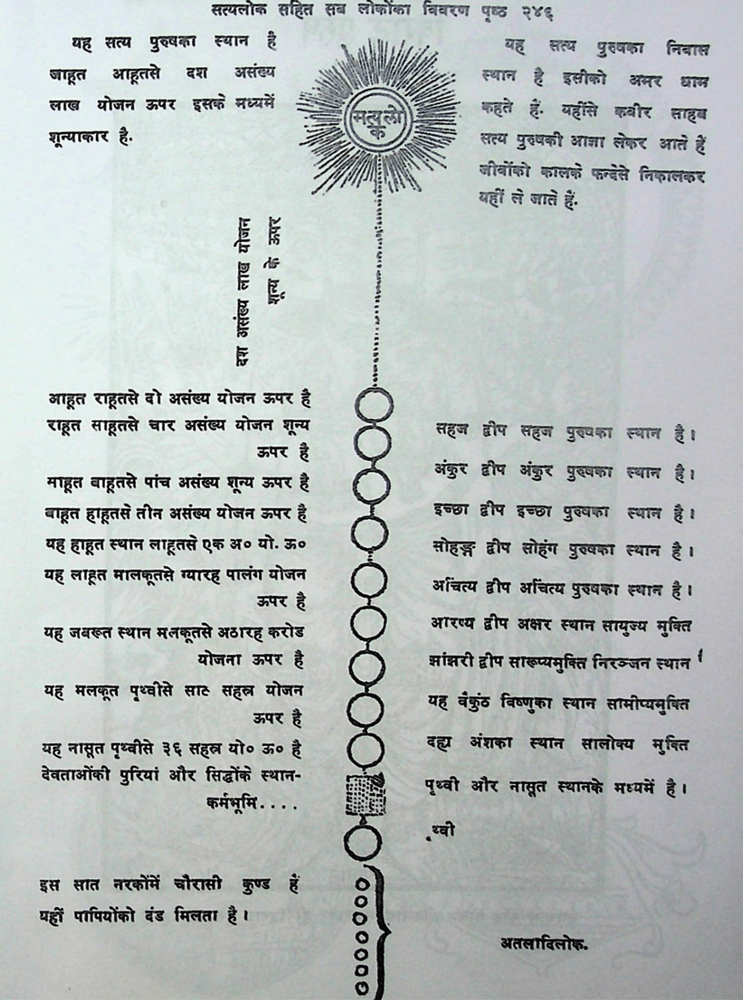
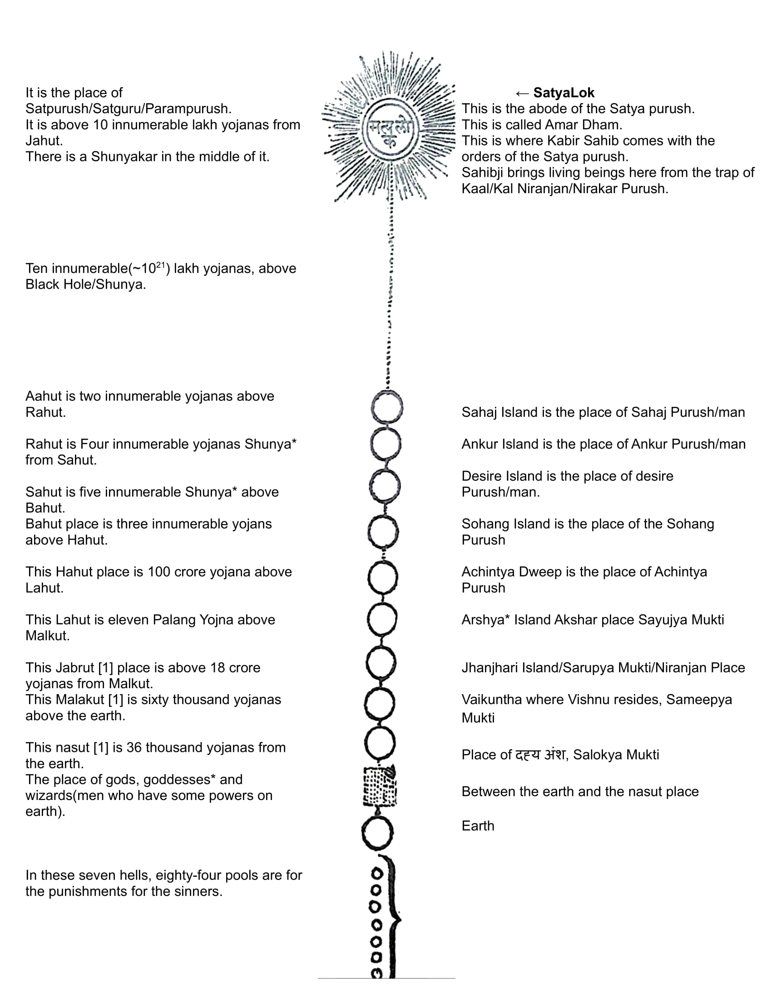

# Satyalok and Universe

*सत्यलोक सहित सब लोकोंका विवरन पृष्ट 246*  
Details of all worlds/universe including Satyalok on page 246

**Read Bottom to top**

**Translated in English**

### Explanantions

* **sAlokya [2]** – going to the ‘loka’ of the deity worshipped.
* **sAmeepya** – being in the proximity of the deity worshipped
* **sArUpya** – taking on the form that looks alike the deity worshipped
* **sAyujya** – getting into the ‘body’ of the deity worshipped (feeling of Aham Brahmasmi)

* **कर्मभूमि/Earth**: Where living beings perform deeds and earn their consequences, it is the place/junction from where we can go to any place we want.
* **Purush/man** is just an alias to that thing, there is no material or gender over there.
* **Shunya** is a place where Niranjan lives and this universe is inside shunya and scientists call it as Black Hole*.
* **1 Yojana = 12kms**
* **Satguru**: The person who has visited/came from Satyalok
* **असंख्य/Asankhya/innumerable**: (~1021)
* **Note**: I don't have exact info for the text which has * marked next to it

| Left Side Translation Bottom to top                          | Right Side Translation Bottom to top                         |
| :----------------------------------------------------------- | ------------------------------------------------------------ |
| *इस सात नरकों में चौरासी कुण्ड यही पापियों को दंड मिलता है* In these seven hells, eighty-four pools are for the punishments for the sinners  कर्मभूमि / Earth  *देवताओं की पुरियां और सिद्धोंका स्थान* The place of gods, goddesses* and wizards(men who has some powers)  *यह नासूत पृथ्वी से ३६ सहस्त्र यो० ऊ० है* This nasut is 36 thousand yojanas from the earth   *यह मलकूत पृथ्वी से साठ सहस्र योजन ऊपर ह* This Malakut is sixty thousand yojanas above the earth.  *यह  जबरूत स्थान मलकूतसे 18 करोड योजना ऊपर है* This Jabrut place is above 18 crore yojanas from Malkut  *यह लाहूत मालकूत से ग्यारह पालंग योजन ऊपर है* This Lahut is eleven Palang Yojna above Malkut.  *यह हाहूत स्थान लाहूत से एक अ० यो. ऊ०* This Hahut place is 100 crore yojana above Lahut  *बाहूत हाहुत से तीन असंख्य योजन ऊपर है* Bahut place is three innumerable yojans above Hahut.  *साहूत बाहूतसे पांच असंख्य शन्य ऊपर है* Sahut is five innumerable Shunya* above Bahut  *राहत साहूतसे चार असंख्य योजन शून्य ऊपर है* Rahut is Four innumerable yojanas Shunya* from Sahut  *आहूत राहूत से दो असंख्य योजन ऊपर है* Aahut is two innumerable yojanas above Rahut.  *दस असंख्य लाख योजन, शुन्य के ऊपर* Ten innumerable(~1021) lakh yojanas, above Black Hole/Shunya  *यह सत्य पुरुष का स्थान है जाहुत आहूत से १० असंख्य लाख योजन ऊपर इसके मध्य में शुन्यकार है* It is the place of Satpurush/Satguru/Parampurush. It is above 10 innumerable lakh yojanas from Jahut, there is a Shunyakar in the middle of it. | पृथ्वी और नसुत स्थान के मध्य में between the earth and the nasut place  *दह्य अंश का स्थान सालोक्य मुक्ति* Location of the left fraction Salokya Mukti   *यह वैकुंठ विष्णु का स्थान सामीप्य मुक्ति* This Vaikuntha is the place of Vishnu, Sameepya Mukti  झांझरी द्वीप सारूप्य मुक्ति निरञ्जन स्थान Jhanjhari Island/Sarupya Mukti/Niranjan Place  आरष्य द्वीप अक्षर स्थान सायुज्य मुक्ति Arshya Island Akshar place Sayujya Mukti   *अचिंत्य द्वीप अचिंत्य पुरुष का स्थान है* Achintya Dweep is the place of Achintya Purush  *सोहंग द्वीप सोहंग पुरुष का स्थान है* Sohang Island is the place of the Sohang Purush  *इच्छा द्वीप इच्छा पुरुष का स्थान है* Desire Island is the place of desire Purush/man.  *अंकुर द्वीप अंकुर पुरुष का स्थान है* Ankur Island is the place of Ankur Purush/man.  *सहज द्वीप सहज पुरुष का स्थान है* Sahaj Island is the place of Sahaj Purush/man.  *यह सत्य पुरुष का निवास स्थान है. इसको अमर धाम कहते है. यही से कबीर साहिब सत्य पुरुष की आज्ञा लेकर आते है.जीवोंको काल के फंदे से निकलकर यही ले जाते है.*  This is the abode of the Satya purush. This is called Amar Dham. This is where Kabir Sahib comes with the orders of the Satya purush. Sahibji brings living beings here from the trap of Kaal/Kal Niranjan/Nirakar Purush. |

### References

(1) [https://en.wikipedia.org/wiki/Sufi_cosmology](https://en.wikipedia.org/wiki/Sufi_cosmology)  
(2) [https://adbhutam.wordpress.com/2010/06/12/the-four-kinds-of-mukti-compared-with-kaivalya-of-vedanta/](https://adbhutam.wordpress.com/2010/06/12/the-four-kinds-of-mukti-compared-with-kaivalya-of-vedanta/)  
(3) [https://docs.google.com/document/d/1AH9iPVY0RTfMChvDvPNfqP8DOsSdAUM](https://docs.google.com/document/d/1AH9iPVY0RTfMChvDvPNfqP8DOsSdAUMgVWzggib_Xa8/edit?usp=sharing)